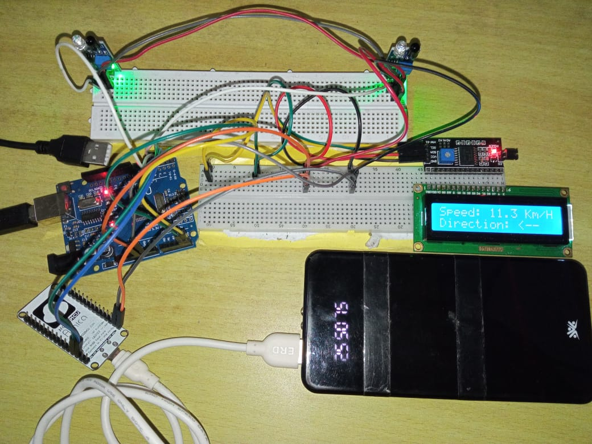

# 🚄 Velocity Detection and Data Transmission using NodeMCU

An IoT-based system designed to monitor train velocity and prevent head-to-head collisions on single-track railway lines. The system uses IR sensors, Arduino Uno, NodeMCU (ESP8266), and IFTTT services to provide real-time data transmission and proactive safety alerts.

---

## 📌 Problem Statement

Head-to-head train collisions on single-track railways pose a major safety concern. Traditional railway systems lack real-time velocity and direction monitoring, making proactive prevention challenging. This project provides a cost-effective IoT solution to detect train velocity and send timely alerts to mitigate such risks.

---

## 🎯 Objectives

- Detect the velocity and direction of trains using IR sensors and Arduino.
- Display real-time speed data using an LCD with I2C.
- Transmit data wirelessly via NodeMCU to a remote server.
- Trigger real-time alerts using IFTTT when speed thresholds are exceeded.

---

## 🧩 Components Used

- **IR Sensors** – Detect train presence and measure velocity.
- **Arduino Uno** – Central controller for sensor data processing.
- **LCD with I2C Module** – Displays real-time speed and direction.
- **NodeMCU (ESP8266)** – Sends train data wirelessly to the server.
- **IFTTT Services** – Used for sending automated alerts (e.g., VoIP calls, webhooks).

---

## 🧠 Software Used

- **Arduino IDE** – For code development and deployment.
- **IFTTT** – Cloud-based automation for alert systems.

---

## 🛠️ System Architecture

The system works as follows:

1. **IR Sensors** placed on track detect the train's passage.
2. **Arduino Uno** calculates speed and direction using timestamps.
3. **LCD Display** shows real-time data to operators.
4. **NodeMCU** transmits the data over Wi-Fi.
5. **IFTTT Services** are triggered if speed exceeds thresholds.

---
## 🖼️ Sensor System Image

 

---

## 🔧 How It Works

1. **Train passes IR sensors** → Trigger timestamps.
2. **Arduino calculates velocity** using distance-time formula.
3. **Data sent to NodeMCU** via serial communication.
4. **NodeMCU posts data to a cloud server**.
5. **IFTTT triggers alerts** when predefined conditions are met.

---

## 🚨 Features

- Real-time train speed and direction display.
- Wireless data transmission to a server.
- Automated alert system using IFTTT for critical situations.
- Low-cost and scalable design.

---

## 🌟 Future Scope

- Integration of GPS modules for precise location tracking.
- Use of machine learning for predictive maintenance and safety.
- Expansion to multi-node systems covering larger railway segments.
- Cloud dashboard for live monitoring and analytics.

---

## 📁 Project Structure

